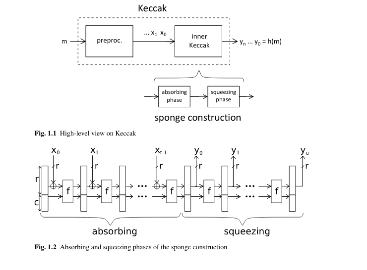
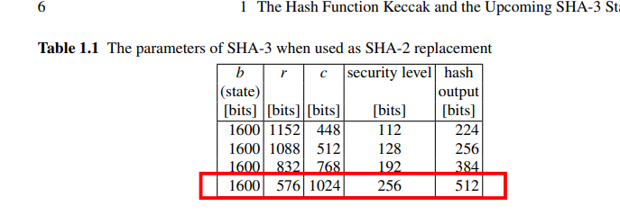
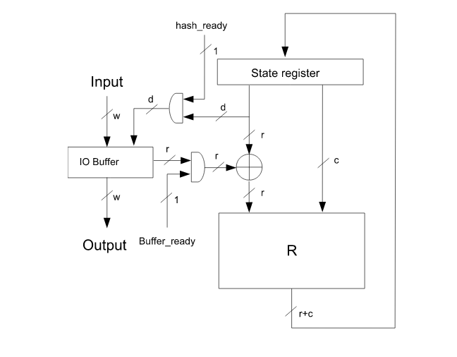

# Parameters:
- **w**: word size: 64 bits
- **b**: 1600 bits
- **r** (rate): b-c = 1600 - 1024 = 576 bits
- **c** (capacity): 2*n = 2 * 512 = 1024 bits
- **n (d in the diagram)** (output hash size): 512 bits 

From the book:

    Top level view of the algorithm

    Top level conceptual diagram of the implementation:

