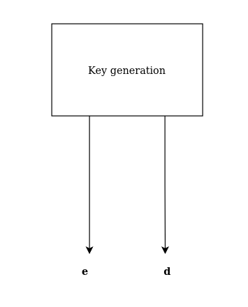

# RSA accelerator - Project for the "Advanced Computer Architecture" course at DTU.
## Group 7:
 - David Risom Pedersen
 - Casper Egholm Jørgensen 
 - Tobias Thomsen

## Ideas for other algorithms and expansions of project

- Stream ciphers (chacha).
- RSA. - Casper
- SHA 3. - David
- Digital signatures.

- Basale operationer (fra discord chat):
    - Modulo
    - Euclid's algorithm
    - Chinese Remainder Theorem
    - Euler's Phi function
    - Symmetric Encryption:
    - Stream ciphers
    - AES
    - DES
    - Block ciphers
    - RSA
    - RSA optimizations
    - El-Gamal
    - Hash functions
    - Symmetric key authentication. MAC algorithms
    - Digital signatures
    - Diffie-Hellman
    - Secret Sharing
    - SHA-3
    - Cryptology: How To Crack It

## Basic ideas for RSA

### The steps of RSA

- Key generation
    - Prime generation
        - ...
        - Miller Rabin
- Encryption/Decryption
    - Square and multiply
    - ...

### Abbreviations
- Message (**m**)
- Cipher text (**c**)
- Public key (**e**)
- Private key (**d**)
- Modulo value (**n**)

### Blocks of RSA

## Scripts
### Square and multiply 

    def square_and_multiply(b, t, num):
        # See page 52 in Cryptology: How to crack it
        w = 1
        for i in range(int.bit_length(t) - 1, -1, -1):
            w = pow(w, 2) % num
            if (t >> i & 1) == 1:
                w = w * b % num
        return w # pow(b, t) % num

### GCD - Might not be needed
    # function for extended Euclidean Algorithm
    def gcdExtended(a, b):
        # Base Case
        if a == 0:
            return b, 0, 1

        gcd, x1, y1 = gcdExtended(b % a, a)

        # Update x and y using results of recursive call
        x = y1 - (b // a) * x1
        y = x1

        return gcd, x, y

### Miller Rabin - step 2 in prime generation (see if the number generated is a prime)
    # Change "iterations" to higher value to be safe!
    def miller_rabin(lower_limit, higher_limit):
        test_numbers = np.arange(lower_limit, higher_limit, 2)
        iterations = 5 # Should be at least 4 to be somewhat safe
        poss_primes = []
        for k in np.arange(iterations):
            for num in test_numbers:
                # Test num = m - 1 = (2^s)*t
                # We determine s and t
                s = 0
                test_num = num - 1
                while (test_num % 2) == 0:
                    test_num = int(test_num / 2)
                    s = s + 1
                t = test_num
                b = randrange(1, num)  # 1 <= b <= m - 1
                y = square_and_multiply(b, t, num)
                #y = pow(b, t) % num
                if y % num == 1:
                    # m is a probable prime
                    poss_primes.append(num)
                    #print(str(num) + " is a prime! Matched on == 1")
                    continue  # Stop and go to next prime to be tested
                for i in np.arange(s):  # i = 0 to and including s - 1
                    if y == (-1 % num):
                        poss_primes.append(num)
                        break
                        #print(str(num) + " is a prime! Matched on == -1")
                    else:
                        y = pow(y, 2) % num
                # If neither case, num is not a prime
            test_numbers = poss_primes
            poss_primes = []
        print(test_numbers)
        print("Miller Rabin test found " + str(len(test_numbers)) + " primes!")

